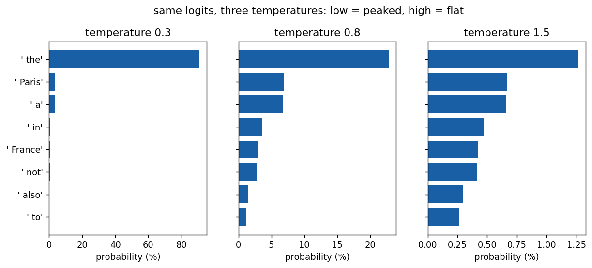
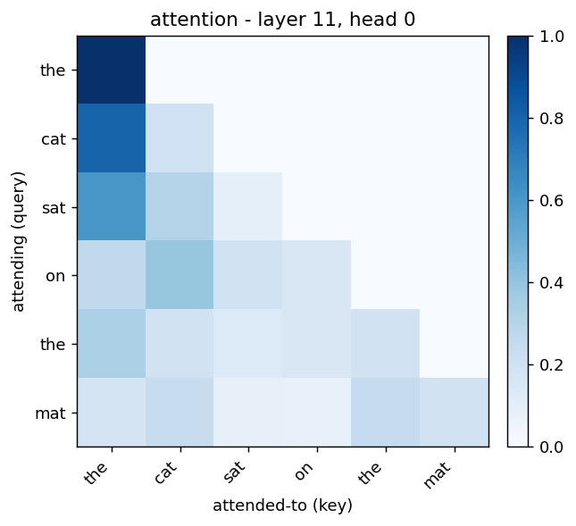
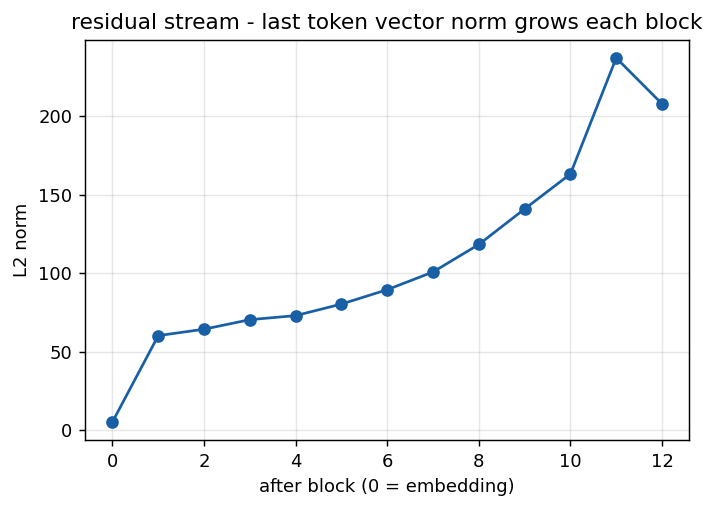

# 🔬 llm-xray

> Watch a **real** GPT-2 think — token by token, layer by layer.


Most explanations of "how large language models work" are diagrams and analogies.
This repo makes it **runnable**: it loads a real pretrained GPT-2 and exposes every
stage of how it turns your text into the next word — tokenization, embeddings,
attention, the residual stream, and temperature-based sampling. Nothing is faked;
every number on screen comes out of the actual model.

It started as a fact-check of the article
[*How LLMs actually work*](https://www.0xkato.xyz/how-llms-actually-work) and grew
into three small tools for *seeing* the pipeline instead of just reading about it.

---

## Contents

- [The big idea](#the-big-idea)
- [Quickstart](#quickstart)
- [Three ways to explore](#three-ways-to-explore)
- [What you're looking at](#what-youre-looking-at)
- [How each stage maps to the pipeline](#how-each-stage-maps-to-the-pipeline)
- [How GPT-2 differs from today's models](#how-gpt-2-differs-from-todays-models)
- [Project structure](#project-structure)
- [Credits](#credits)

---

## The big idea

A language model writes by adding **one word at a time**. To choose each word it:

1. **Scores** every word in its 50,257-word vocabulary,
2. **Looks back** at the words so far (attention) to decide, then
3. **Picks one**, adds it, and repeats.

How sharply it favours its top guess is controlled by a single knob —
**temperature**. The exact same model output, sampled at three temperatures:



Low temperature → peaked and safe. High temperature → flat and surprising. That one
picture is the heart of why the same model can be boringly predictable or wildly
creative.

---

## Quickstart

Needs Python 3.9+. First run downloads GPT-2 (~500 MB) and caches it.

```bash
git clone https://github.com/swarina/llm-xray.git
cd llm-xray

python3 -m venv .venv
./.venv/bin/pip install -r requirements.txt

# pick one:
./.venv/bin/python llm_xray.py     # terminal walkthrough
./.venv/bin/python app.py          # static browser UI  → http://127.0.0.1:7860
./.venv/bin/python live.py         # live generation UI → http://127.0.0.1:7861
```

Prefer not to type the venv path each time? `source .venv/bin/activate` once, then
plain `python live.py` works for that terminal.

---

## Three ways to explore

| Tool | Where | Best for |
|---|---|---|
| [`llm_xray.py`](llm_xray.py) | terminal | reading all five stages printed out, plus a saved attention heatmap |
| [`app.py`](app.py) | browser, `:7860` | poking one prompt with sliders and seeing four panels update |
| [`live.py`](live.py) | browser, `:7861` | **watching it generate word by word, narrated step by step** |

**`live.py` is the one to start with.** Press *generate* and the autoregressive loop
unfolds in slow motion: a plain-English narration of each step, the candidate words
it's weighing, which earlier words it attended to, a confidence meter, and a running
decision log. Use the *seconds per word* slider to slow it down enough to follow.

The terminal tool takes flags, e.g.:

```bash
./.venv/bin/python llm_xray.py --text "i love programming in" --generate 12
./.venv/bin/python llm_xray.py --text "the capital of france is" --layer 10 --head 7
./.venv/bin/python llm_xray.py --temperature 0.3
```

---

## What you're looking at

A beginner-friendly tour of the concepts each tool surfaces.

### Tokens
Models don't read letters — they read **integer ids** for *subword* chunks. The word
`strawberry` becomes `['st', 'raw', 'berry']`, which is exactly why models are bad at
"how many r's in strawberry?": they never see the individual letters.

### Embeddings
Each id looks up a row in a big table — a **vector** of 768 numbers (for GPT-2;
4,096 for a 7B model). Similar words end up with similar vectors. This is the model's
"meaning" of a token before any context is applied.

### Attention
Before choosing the next word, each token **looks back** at earlier tokens and decides
which ones matter. The blank upper-right triangle is the *causal mask* — a token can
never see the future.



### The residual stream
Each layer doesn't replace the token's vector — it **adds** to it. So information has a
direct path from the input all the way to the top. You can watch the vector literally
grow:



### Logits, temperature & sampling
The final vector becomes one **logit** (score) per vocabulary word. Dividing the logits
by **temperature** and applying softmax turns them into probabilities; the model then
**samples** one. Low temperature ≈ always take the top word (predictable); high
temperature ≈ give long-shots a real chance (creative). See the figure up top.

---

## How each stage maps to the pipeline

| Stage in the code | What you actually see |
|---|---|
| 0 · Tokenization | your text → subword ids; why `strawberry` is hard to spell |
| 1 · Embeddings | the real 768-dim embedding matrix and your last token's vector |
| 2 · Attention | a real attention matrix for any layer/head, plus a heatmap |
| 3 · Residual stream | the last token's vector norm growing block by block |
| 4 · Logits → next token | top candidates and how temperature reshapes them |
| 5 · Generation | the loop repeated into a full sentence |

---

## How GPT-2 differs from today's models

GPT-2 (2019) is the most inspectable open model, but it predates a few things modern
models treat as standard. The shape of the pipeline is identical — only these details
changed. The tools point each one out as you hit it.

| Component | GPT-2 | Modern (LLaMA-style) |
|---|---|---|
| Position info | learned absolute embeddings | **RoPE** (rotary) |
| Normalization | LayerNorm | **RMSNorm** |
| Attention | full multi-head | **Grouped-Query Attention** + KV cache |
| FFN activation | GELU | **SwiGLU** |

---

## Project structure

```
llm-xray/
├── llm_xray.py        # terminal: prints all 5 stages, saves a heatmap
├── app.py             # static Gradio UI (port 7860)
├── live.py            # live token-by-token Gradio UI (port 7861)
├── requirements.txt   # torch, transformers, matplotlib, numpy, gradio
├── docs/
│   ├── make_figures.py   # regenerates the figures below
│   └── fig-*.png         # example outputs used in this README
├── LICENSE
└── README.md
```

Regenerate the README figures any time with:

```bash
./.venv/bin/python docs/make_figures.py
```

---

## Credits

- Concept and fact-check inspiration: [*How LLMs actually work*](https://www.0xkato.xyz/how-llms-actually-work)
- Model: [GPT-2](https://huggingface.co/gpt2) via 🤗 [Transformers](https://github.com/huggingface/transformers)
- UI: [Gradio](https://www.gradio.app/)

Licensed under the [MIT License](LICENSE).
